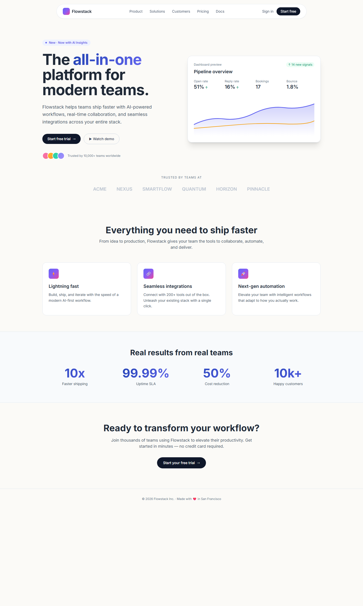
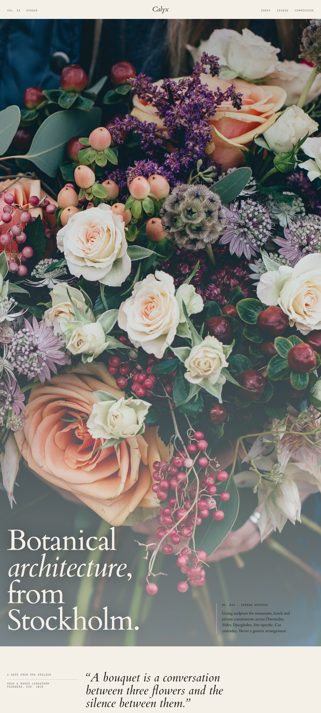
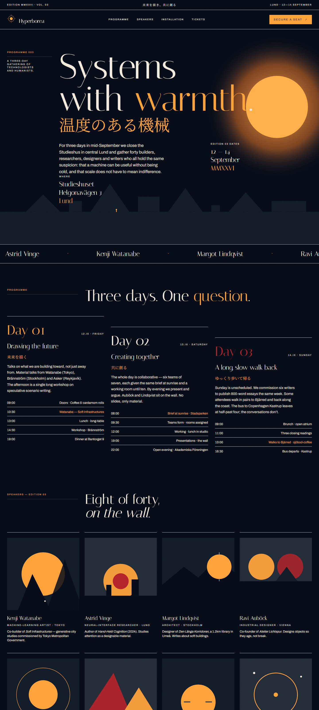
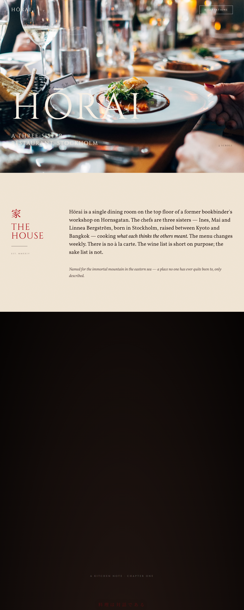
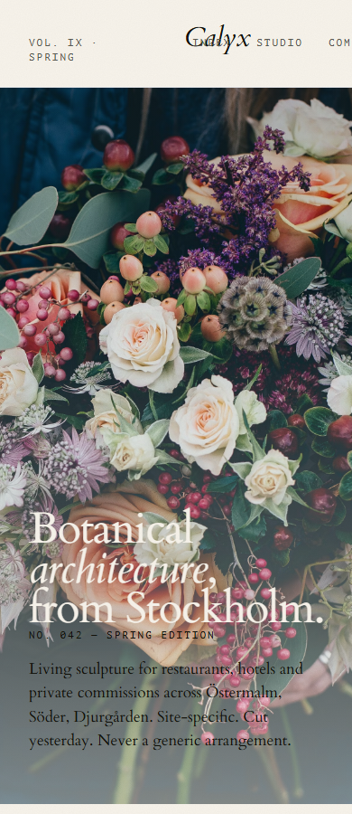
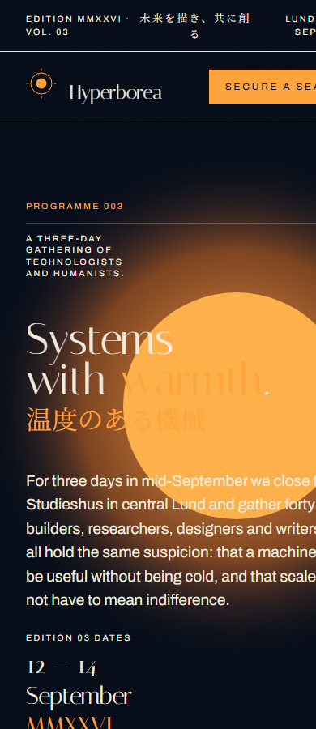
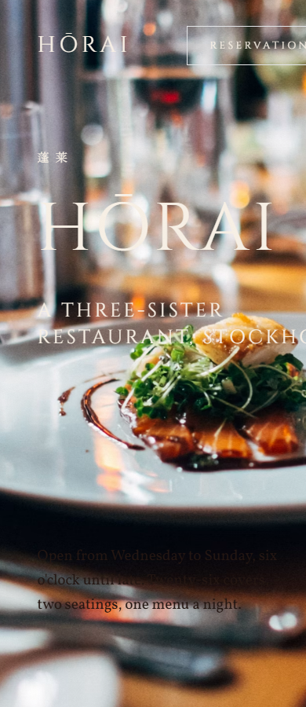

# Anti-Slop Design — one router, the right skills, every time

> Three landing pages, three aesthetic lanes, **one master skill** routing the right specialists from a stack of 32 audited Claude Code design skills. Built in ~20 minutes in a single Claude Code session, Opus 4.7. The work that the upstreams do is excellent; this repo's only contribution is making sure the right one fires for each task.

[**→ Live demos**](#the-proof--three-sites)  ·  [**The router (300 lines)**](skills/design/SKILL.md)  ·  [**Full audit of 32 skills**](AUDIT.md)  ·  [**Credits to every upstream**](attribution/UPSTREAMS.md)

---

## The problem in one image

<table>
<tr>
<td align="center"><sub><b>What every AI coding tool ships by default</b></sub></td>
</tr>
<tr>
<td></td>
</tr>
</table>

Inter, sticky pill nav, gradient text, chart card on the right, 4-column metric grid with tiny captions, 3-column "feature" cards with icon + title + body, big-number row, gradient CTA. Familiar? It should be. Every AI tool produces this. Every AI tool produces *exactly* this.

The problem isn't that the skills to do better don't exist — they do, and they're brilliant — it's that the model can't reliably pick the right one from 30+ overlapping descriptions, and even when it does, it doesn't compose them in the right order, and even when it does *that*, the model still falls back to base AI taste at the first ambiguity. Premium skills installed; AI-slop shipped.

This repo's answer: one **master router skill** that detects the task, names an aesthetic lane, runs slop tests, layers the right specialist, blocks the bans, and forces a polish pass. Type `design` and it fires.

## The proof — three sites

Each was produced through the router in this repo, from a single prompt, in a different aesthetic lane. Each lives behind a `/` URL on the deployed showcase. **None of them could be confused for the page above.**

| Site | Aesthetic lane | Specialists the router fired | Demo |
|---|---|---|---|
| **Calyx** — Stockholm botanical atelier | Editorial luxury minimalism (cream + charcoal + layered botanical photography, Cardo italic display) | Impeccable + high-end-visual-design (Editorial Luxury archetype) | [Live](https://anti-slop-design.vercel.app/calyx) · [Source](sites/calyx.html) |
| **Hyperborea Summit MMXXVI** — speculative-futurist conference | Drenched dark navy + amber, bilingual EN/SV/JP, illustrated SVG sun-disc speaker portraits | Impeccable + gpt-taste (AIDA scrolltelling) + design-taste-frontend (perpetual micro-motion) | [Live](https://anti-slop-design.vercel.app/hyperborea) · [Source](sites/hyperborea.html) |
| **Hōrai** — a three-sister restaurant, Stockholm | Drenched warm (rice-paper cream + lacquer red, monumental Cinzel display, literary Vollkorn body, large food photography for a high-end Asian-fusion dining room) | Impeccable + designpowers/design-taste | [Live](https://anti-slop-design.vercel.app/horai) · [Source](sites/horai.html) |

### Screenshots

<table>
<tr>
<td align="center" width="33%"><sub><b>Calyx</b> — editorial luxury</sub></td>
<td align="center" width="33%"><sub><b>Hyperborea</b> — speculative-futurist</sub></td>
<td align="center" width="33%"><sub><b>Hōrai</b> — drenched warm</sub></td>
</tr>
<tr>
<td></td>
<td></td>
<td></td>
</tr>
<tr>
<td></td>
<td></td>
<td></td>
</tr>
</table>

## What the router does in six lines

1. **Classifies the task** into one of seven lanes (ground-up build / redesign / polish / reference-driven / component / direction-only / audit).
2. **Forces a named aesthetic lane** before any token is picked. Not *"modern and minimal"* — something like *"Klim orange drench"* or *"Bloomberg Terminal meets Swiss specimen"*.
3. **Runs both slop tests.** Could someone guess the palette from the category alone? Could they guess the aesthetic family from category-plus-anti-references? If yes, rework.
4. **Layers the right specialist** for the chosen lane (Impeccable spine + one of: gpt-taste, high-end-visual-design, design-taste-frontend, minimalist-ui, industrial-brutalist-ui; plus extract-design when a reference URL is supplied).
5. **Enforces five hard bans.** No Inter. No centered hero stack. No 3-col icon cards. No hero-metric template. No `#fff`/`#000`.
6. **Always ends with `impeccable polish`** — alignment to the design system, drift resolved by root cause.

Full plain-English explainer in [ROUTER.md](ROUTER.md). The actual skill is one file: [`skills/design/SKILL.md`](skills/design/SKILL.md).

## The audit — what got picked, what got demoted

Out of 32 design-related skills installed on my machine (across `~/.agents/skills/` and `~/designpowers/skills/`), the router relies on five. The rest are either redundant, niche, project-locked, or process-heavy. The full audit table with per-skill scores on a five-axis rubric (anti-slop teeth / aesthetic ceiling / execution fidelity / routing clarity / maintenance cost) is in [AUDIT.md](AUDIT.md).

| Rank | Skill | Verdict |
|---|---|---|
| 1 | Impeccable | Primary engine — strongest anti-slop teeth, register-aware, 22 sub-commands |
| 2 | design-taste-frontend (taste-skill) | Anti-bias enforcer with Bento 2.0 + 5-card archetypes |
| 3 | high-end-visual-design (taste-skill) | Apple/Linear detail vocabulary (Double-Bezel, button-in-button, Variance Engine) |
| 4 | gpt-taste (taste-skill) | Awwwards lane — AIDA + GSAP scrolltelling + 2-line H1 iron rule |
| 5 | extract-design | URL → tokens (the only skill that operates on existing sites instead of briefs) |
| 6–14 | minimalist-ui, industrial-brutalist-ui, polish, redesign-existing-projects, brandkit, imagegen-frontend-web, image-to-code, designpowers/design-taste, designpowers/motion-choreography | Conditional / phase-specific |
| 15–26 | (taste-feedback, ui-composition, designpowers-critique, vercel-composition-patterns, vercel-react-best-practices, web-design-guidelines, ui-ux-pro-max, others) | Demoted — process-heavy, accessibility-led, or compliance-checklists that cap aesthetic ceiling |
| 27–32 | (using-designpowers, stitch-*, design-md, react-components, webpage-builder) | Skip unless project demands them (welcome-ritual overhead, Stitch MCP required, project-locked) |

The top picks are the same five that this repo composes. The router is the routing layer; **the upstreams are where the taste lives**.

## Credits — please star these repos

The five upstreams the router composes, with verified star counts at publish time:

| Repo | Stars | License | What it provides |
|---|---:|---|---|
| [pbakaus/impeccable](https://github.com/pbakaus/impeccable) | 29.2k | Apache 2.0 | The engine: 22 sub-commands, brand vs product register, named reflex-reject font + aesthetic-lane lists, polish + critique flow |
| [Leonxlnx/taste-skill](https://github.com/Leonxlnx/taste-skill) | 18.4k | MIT | design-taste-frontend, gpt-taste, high-end-visual-design, minimalist-ui, industrial-brutalist-ui |
| [google-labs-code/stitch-skills](https://github.com/google-labs-code/stitch-skills) | 5.6k | Apache 2.0 | Stitch MCP integration (loaded only when user opts in to Stitch) |
| [Manavarya09/design-extract](https://github.com/Manavarya09/design-extract) | 2.8k | MIT | URL → 8 token output files via `designlang` npm |
| [Owl-Listener/designpowers](https://github.com/Owl-Listener/designpowers) | 175 | MIT | 9-agent inclusive design workflow + taste calibration + motion choreography |

Detailed credits, per-skill descriptions, and install commands in [attribution/UPSTREAMS.md](attribution/UPSTREAMS.md).

## Install — three steps

```bash
# 1. Install the upstreams (only the ones you'll actually use)
git clone https://github.com/pbakaus/impeccable ~/.agents/skills/impeccable
git clone https://github.com/Leonxlnx/taste-skill ~/.agents/skills/taste-skill
# (and the others from attribution/UPSTREAMS.md as needed)
npm install -g designlang   # for the extract-design skill

# 2. Drop the router in place
mkdir -p ~/.agents/skills/design
curl -L https://raw.githubusercontent.com/oloflun/anti-slop-design/main/skills/design/SKILL.md \
  -o ~/.agents/skills/design/SKILL.md

# 3. In Claude Code, type the trigger word in front of any brief:
#    > design a premium landing page for my fly-fishing rod brand
```

That's it. The router fires, it picks the lane, runs the slop tests, layers the specialist, blocks the bans, builds the page, runs polish.

## The honest footnote

This whole thing — the audit of 32 skills, the router skill, three full landing pages, screenshots at desktop + mobile, the write-up — was produced in a single Claude Code session, Opus 4.7 high, **wall-clock under 20 minutes**. Built on a Windows machine, Tailwind CDN, Google Fonts, Chrome headless for screenshots. No build pipeline. No CI. No Next.js scaffolding.

The output is not magic. The output is the upstreams above, composed correctly, for the first time. **Star them.**

---

<sub>Built by [@oloflun](https://github.com/oloflun). MIT for the routing layer; upstreams under their own licenses. The Snipra brand referenced in some session logs is private and intentionally not in this repo — its rebuild lives offline, in my drawer, until further notice.</sub>
